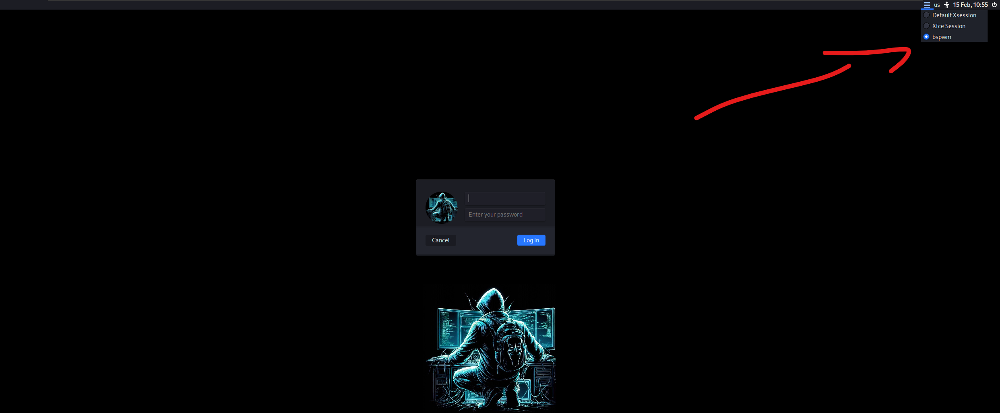
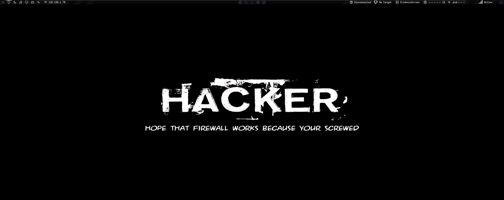
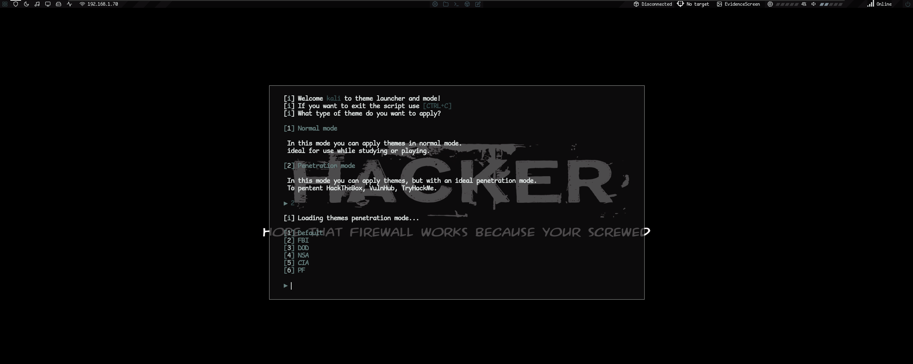

Execute

```bash
chmod +x setup.sh root.sh;./setup.sh;sudo ./root.sh
```

# Bspwm - NSA THEME

BSPWM perfeito para jogar ctf e trabalhar.

Basta seguir os comandos abaixo para o auto-install e ele fará tudo pra você!

1.- Faca uso do script como usuario comum e nao administrativo:

```bash
git clone https://github.com/al4xs/bspwm-setup

cd bspwm-setup

chmod +x setup.sh root.sh;./setup.sh;sudo ./root.sh
```

Terminou o script? Faça logout. Na tela de login no seu lado direito superior proximo ao selecionar idioma, selecione BSPWM e realize o login novamente.



Abaixo, uma pequena demonstração de como seu ambiente vai ficar:






********************** Atalhos UTEIS para seu novo System ****************************

`ctrl + shift + t` = abre o terminal

`Windows + d` = abre o menu principal

`ctrl + w` = fecha o terminal 

`Windows + r` = faz um reload no sistema

`Windows + x` = bloqueia a tela

`Windows + Shift + ⬆⬇⮕⬅` = troca a workspace de lugar

`Windows + ⬆⬇⮕⬅` = navega nos terminais abertos

`Windows + Alt + ⬆⬇⮕⬅` = Redimenciona os terminais

`CTRL + Windows + Alt + ⬆⬇⮕⬅` = seleciona uma workspace para abrir

`CTRL + Windows + Alt + Backspace` = cancela uma workspace


obs: Todos os atalhos pré-definidos você pode encontrar em:  ~/.config/sxhkd/sxhkdrc

---------------------- comandos no terminal ----------------------


`settarget 10.10.10.10 box.htb`  seta a box no target da polybar

`pavucontrol` abre administração do audio, pra aumentar e abaixar o volume

`logout` faz logout na sua maquina

`desligar` desliga a maquina

`thunar` Abre o visualizador de arquivo

`rmk arquivo.txt`  remove arquivos e dificulta a recuperação dos dados com tecnicas forense


## Comandos legais:

`neofetch`  Mostra informações do sistema

`cmatrix`  Simula o matrix

`matrix`  Simula a nostalgia do filme 'knock knock neo'

`hollywood`  Simula hacking de hollywood

`server`  abre o servidor na porta 80

`pipes`  Cobrinha no terminal

`catn arquivo.txt`  Visualiza um arquivo com cores

`ranger`  Navega em diretórios via terminal

## Dúvidas Frequentes:

Como trocar o wallpaper?

`nano ~/.config/bspwm/bspwmrc` altere o destino/path da imagem nesse arquivo;

Como trocar o esquema de cores do terminal?

`wal --theme random_dark`  Via randomica

Pra que serve a pasta "go/bin" na minha home?

`ls ~/go/bin/`  Tudo que voce instalar via go vai pra essa pasta, e voce pode chamar de qualquer lugar do terminal

---

## 📝 Licença

Feito por Michael (osungjinwoo) 👋🏽 [Entre em contato!](https://www.linkedin.com/in/michael-al4xs/)

HACK THE PLANET!
---
